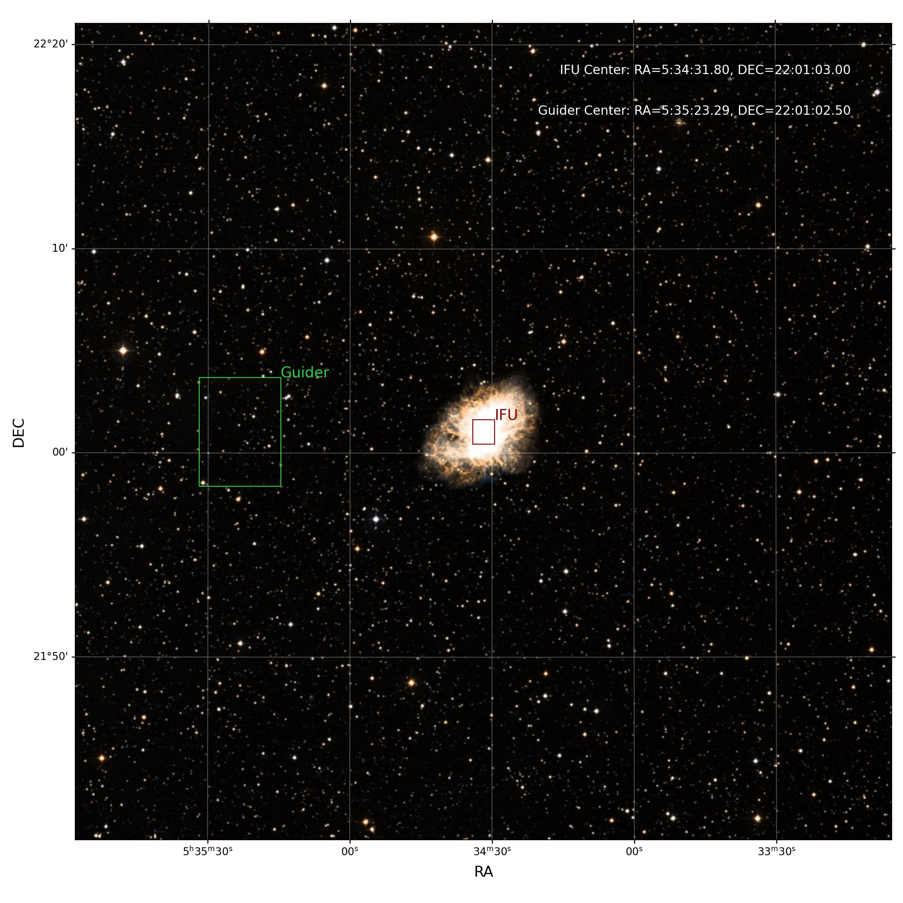
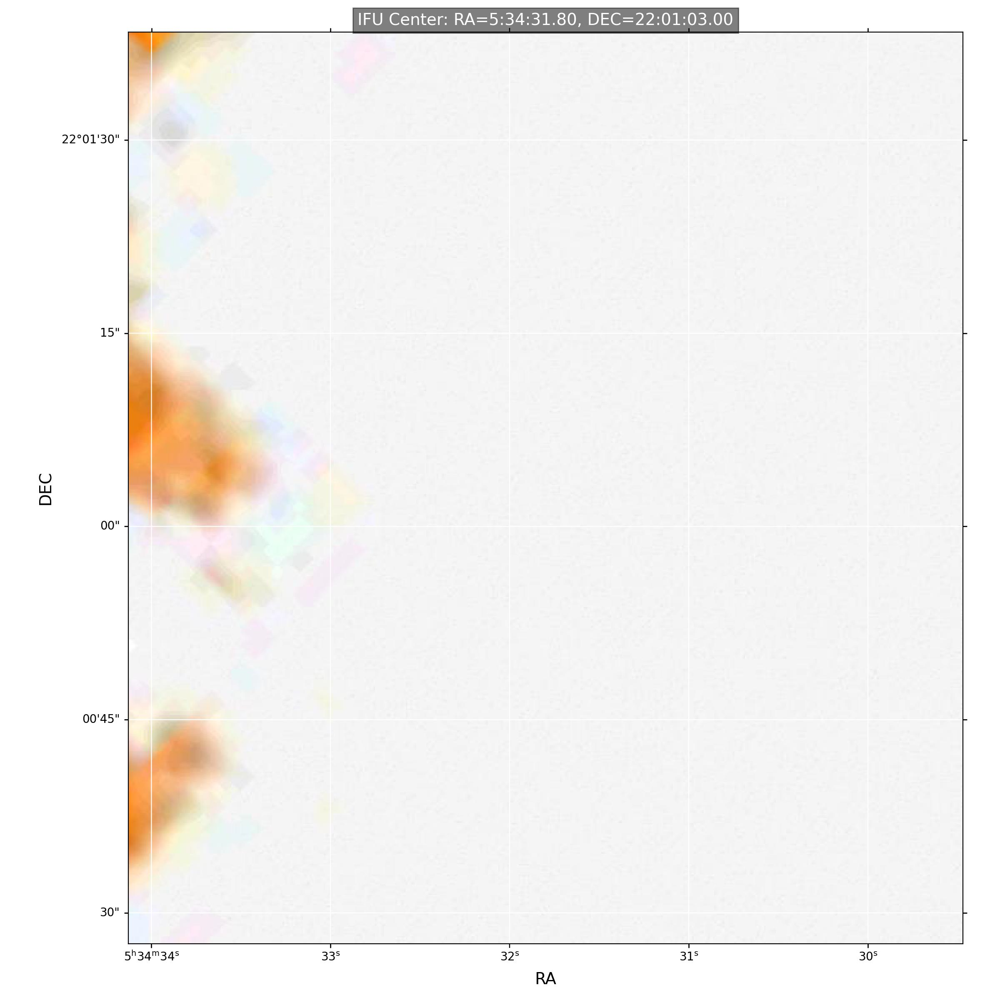

## 安装
chiliapt can be installed with the following shell command

```shell
git clone https://github.com/bszzhzxyf/chiliapt.git
cd chiliapt
pip install .
# 或者只安装在用户目录下:
pip install . --user

# 卸载
pip uninstall chiliapt
```

##使用

```
from chiliapt import ChiliAPT
from astropy.coordinates import SkyCoord
from astropy import units as u
from astropy.time import Time

# M1蟹状星云ra,dec坐标 05:34:31.8 +22:01:03
c1= SkyCoord("05:34:31.8 +22:01:03",unit=(u.hourangle, u.deg), frame="icrs")
ra_p = c1.ra.deg       #中心指向的ra
dec_p = c1.dec.deg     # 中心指向的dec
PA_p = 0               # Position Angle
center = "IFU"          # 如果写"Guider"就以导星为中心
save_path = './APT_result/' #生成的图片保存的路径
apt = ChiliAPT(ra_p=ra_p,           
               dec_p=dec_p, 
               PA=PA_p, 
               center=center,    
               observe_time=Time('2024-11-12'), 
               save_path=save_path, 
               plot_sky=True,         # 是否绘制天球图
               plot_stars=True,       # 是否绘制gaia星表投影
               random_transform=False)
```

## 功能
输入Chili IFU中心指向的的ra、dec、PA角
输出: 1. IFU和导星在dss星图上的位置
      
      2.IFU和导星视场内的dss星图，以及中心指向
      
      
      3. Gaia星表投影在Chili焦面上的样子
      
      4. Gaia星表投影在IFU上的位置,越亮的星越大
      
      5. Gaia星表投影在Guide上的位置,越亮的星越大
      

这里绘制的Guider是竖着的，是因为RA是沿着Guider的短边方向的。实际读出的Guider图像是横向的。得旋转90度才能和本图像对应。

详情请参考chiliapt_example.ipynb，以观测蟹状星云M1为例


## 更新记录:
2024-11-12 增加以导星为中心的指向功能
           分别输出IFU和导星视场内的dss星图，以及中心指向
