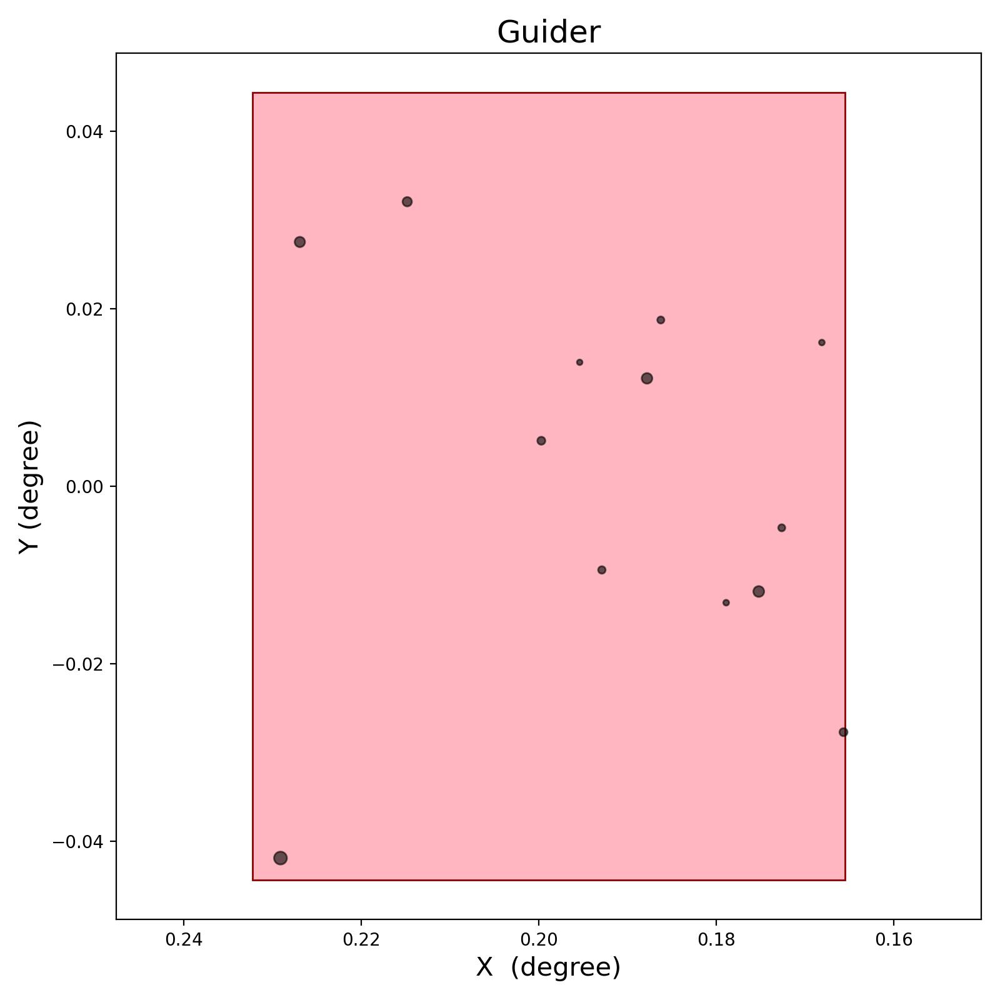

## 安装
chiliapt can be installed with the following shell command

```shell
git clone https://github.com/bszzhzxyf/chiliapt.git
cd chiliapt
pip install .
```

## 功能
输入Chili IFU中心指向的的ra、dec、PA角
输出: 1. IFU和导星在dss星图上的位置
      
      2. Gaia星表投影在Chili焦面上的样子
      
      3. Gaia星表投影在IFU上的位置,越亮的星越大
      
      4. Gaia星表投影在Guide上的位置,越亮的星越大
      

详情请参考chiliapt_example.ipynb，以观测蟹状星云M1为例
